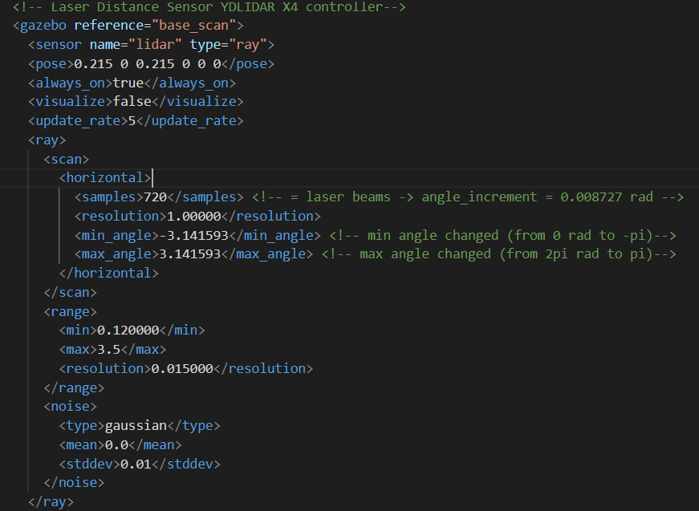
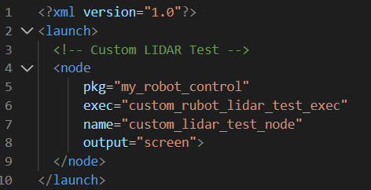
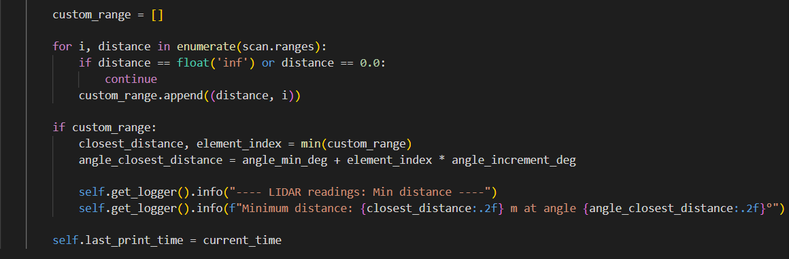

# **Lab Activity: Lidar test**
Marc Font, Laia Raja and Alba Navarro


### 1. Lidar specifications in the .URDF file
The Lidar specifications in the urdf file `rubot_mecanum_lidar.urdf` are in the *Laser Distance Sensor YDLIDAR X4 controller* section. Our lidar sensor is a RPLIDAR A1 with the following specifications:
- angle_min: -3.141593 (rad)
- angle_max: 3.141593 (rad)
- angle_increment: 0.008727 (rad)  -> 720 laser beams

In this section we changed the angle_min from 0 rad to $-\pi$ rad (-3.141593 rad) and the angle_max from $-2\pi$ rad to $\pi$ rad (3.141593 rad).
The angle_increment is defined as laser beams wich is defined as 760 samples. We didn't change this in the urdf file.




### 2. Create the new launch and the new python file
We created these new files  to verify the proper Lidar readings:
- New launch file name: `custom_rubot_lidar_test.launch.xml`
- New python file name: `custom_rubot_lidar_test.py`

The launch file is: 



We had to update the setup.py in my_robot_control:
    ```shell
    'custom_rubot_lidar_test_exec = my_robot_control.custom_rubot_lidar_test:main'
    ````

The `custom_rubot_lidar_test.py` is the same file as `my_robot_lidar_test.py` with these changes:
- Change the line 31 from `index_0_deg = int((0 - angle_min_deg -180)/ angle_increment_deg)` removing *-180* to `index_0_deg = int((0 - angle_min_deg)/ angle_increment_deg)` because we now defined the angle_min as $-\pi$
- The original version converts angles into -180º and 180º because angle_min was 0 and angle max was 360º. We do not need in the new code because the angle_min is already -180º rad and the angle_max is 180º.
- The original code filters only frontal angles from -150º to 150º but in the new version we take all the angles.




### 3. Launch and verify
We launch the bringup with the new `rubot_mecanum_lidar.urdf`
    ```shell
    ros2 launch my_robot_bringup my_robot_bringup_sw.launch.xml x0:=1.0 y0:=-0.5 yaw0:=0.0 rubot:=rubot/rubot_mecanum_lidar.urdf custom_world:=square3m_walls.world
    ````


and then the new launch `custom_rubot_lidar_test.launch.xml`
    ````shell
    ros2 launch my_robot_control custom_rubot_lidar_test.launch.xml 
    ````


    - Are the Lidar readings correct?
    - what do you think it could hapen?

- Launch the `my_robot_lidar_test_rUBot.launch.xml` file and show:
    - The minimum distance and angle to a wall detected by the Lidar
    - The distances at 0º, 90º and -90º with respect to the robot front


Upload a pdf file with a picture including:
- Gazebo bringup where you can see the robot in a speciffic POSE in the world
- terminal running the `my_robot_lidar_test_rUBot.launch.xml` with distances readings
